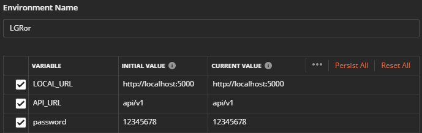
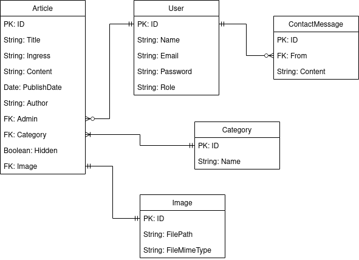

# Eksamen_Webapplikasjoner

### .env configuration on server

`See .env.txt in server folder`

Rename `.env.txt` to `.env` to use in project

### .env configuration on client

`See .env.txt in client folder`

Rename `.env.txt` to `.env` to use in project

## Available Scripts

To start the server, first do:

`cd server`

When your're in the `server` folder, first install dependencies with:

`npm install`

Then start the server with:

`npm run dev`

Starts the server in the development mode.\

### Then open up a new terminal window and navigate to the `client` directory

`cd client`

When inside `client` directory, install all dependencies with:

`npm install`

After all dependencies are installed, type:

`npm run dev`

## Project will now be available on localhost

Open (http://localhost:3000) to view it in the browser.

The server will automatically restart if you save any edits you make. \
You will also see any requests made in the console.

## Changing the environment

If you want to change the environment to check the security features, you have to change NODE_ENV in .env to production:

NODE_ENV = development -> NODE_ENV = production

Security features have been disabled for the development environment.

## Users

There are two users in the database already, but more can be made on the sign up page.
Admin users can only be made through Postman, but you can create a user with a default role.

### Admin:

Email: `admin@lgror.no`
Password: `12345678`

### User:

Email: `user@lgror.no`
Password: `12345678`

## Postman environment

These are the variables you need in order to send request from Postman

### Postman documentation

[Link to Postman documentation] (https://documenter.getpostman.com/view/13486177/TVmV7Ziw)

## UML

UML of the models and their relations

## Trello

[Link to Trello board] (https://trello.com/b/aRLZpjuT)

## Bugs 

After starting the client, you may encounter a problem where the client will not compile because of some style files.
We have not found the reason why this problem appears, but it has to do with the import of `ArticleStyles.js` in `ArticleDetailedView.jsx`, `Articles.jsx` and `ArticleFrom.jsx` all being lowercase. 
The solution:
- Rename the imports of `ArticleStyles.js` from `articleStyles.js` to `ArticleStyles.js`

## Sources

- server > utils > apiFilters, sendEmail, validation, jwtToken: kodeeksempel fra forelesning modul 14
- server > services > image: kodeeksempel fra forelesning modul 13
- server > middleware: kodeeksempel fra forelesning modul 13
- server > schemas > user: kodeeksempel fra forelesning modul 13
- client > layouts > mainlayout > linje 9-11: (https://css-tricks.com/couple-takes-sticky-footer)
- client > components > LoginForm > kodeeksempel fra forelesning modul 13
- client > routes > AdminRoutes > kodeeksempel fra forelesning modul 13
